前言

随着 Docker 技术的不断成熟，越来越多的企业开始考虑使用 Docker 持续集成、版本控制、可移植性、隔离性和安全性的优势上有着不可替代的优势,在看似稳定而成熟的场景下，使用 Docker 的好处越来越多,所以趁着开年摸鱼期间,学习了一下 docker 的基本应用

- docker 刷新了我对状态保存的认知,传统的虚拟技术的状态保存是依靠快照的方式来记录,切换速度贼慢,docker 引入了类似于 git 的代码管理的概念,容器版本一一记录,切换效率和成本大大提高
- docker 也可以当做一个云计算平台,可以很轻松的实现一个沙盒隔离的概念,实现文件、资源、网络等隔离,dock 的可以利用这些方式实现类似于 paas 平台的应用隔离
- 就我目前对 docker 的理解,docker 就是在基于一台有操作系统服务器上可部署的多个虚拟主机,各虚拟环境相互隔离的状态

# 特性

_以下特性是我复制粘贴的 😆_

---

**文件系统隔离：**每个进程容器运行在完全独立的根文件系统里。

**资源隔离：**可以使用 cgroup 为每个进程容器分配不同的系统资源，例如 CPU 和内存。

**网络隔离：**每个进程容器运行在自己的网络命名空间里，拥有自己的虚拟接口和 IP 地址。

**写时复制：**采用写时复制方式创建根文件系统，这让部署变得极其快捷，并且节省内存和硬盘空间。

**日志记录：**Docker 将会收集和记录每个进程容器的标准流（stdout/stderr/stdin），用于实时检索或批量检索。

**变更管理：**容器文件系统的变更可以提交到新的映像中，并可重复使用以创建更多的容器。无需使用模板或手动配置。

**交互式 Shell：**Docker 可以分配一个虚拟终端并关联到任何容器的标准输入上，例如运行一个一次性交互 shell。

# 应用场景

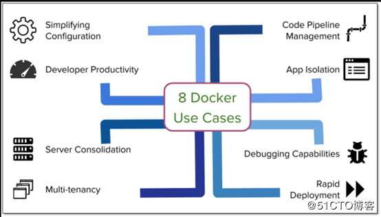

- 简化配置:统一配置,通过镜像快速启动

- 代码流水线管理: 开发环境->测试环境->预生产环境->灰度发布->正式发布，docker 在这里可以快速实现迁移

- 提高开发效率:开发者来说,有了镜像,直接启动容器即可,就像在自己本地跑自己的项目一样简单

- 隔离应用:相对于虚拟机的完全隔离会占用资源，docker 会比较节约资源

- 服务器整合:同一台服务器可以跑多个 docker 容器，提高服务器的利用率

- 调试能力:docker debug :exec,ps,top,stats,events,logs

- 多租户:感觉类似于子主账号

- 快速部署

# 概念

**镜像**

只读模板

**仓库**

集中存放镜像文件的地方,和 git 的概念类似,有公开和私有之分,用户创建自己的镜像后可以使用 push 上传到仓库,在使用时随时 pull 下来

**容器**

区别于镜像的唯一区别在于容器是可读写的

# 操作

### 获取镜像

`docker pull`

从仓库拉取镜像

例如: `docker pull node`

相当于 `docker pull registry.hub.docker.com/centos:lastest`

从其他仓库下载时需要指定完整的仓库地址

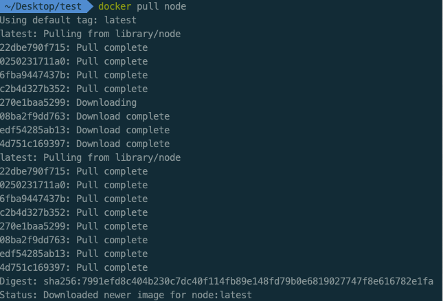

### 查看镜像列表

`docker images`

列出了所有顶层镜像,每个顶层下隐藏了多个镜像层

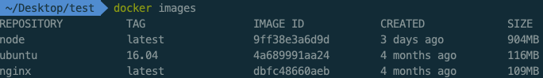

- 来自哪个仓库,如 node
- 镜像标记 比如 latest(最新的)
- 唯一 ID
- 创建时间
- 镜像大小

### 创建镜像

`docker build` 或 `docker commit`

#### docker build

```bash
mkdir 85ido

cd 85ido

vim Dockerfile
#这里需要到Dockerfile下修改这个文件
```

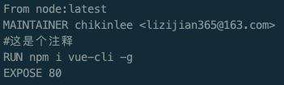

```bash
 docker build -t 85ido/node:1.0 .
```

其中-t 来标识添加的 tag,指定新的镜像用户信息, "." 是 Dockerfile 所在的路径(当前路径),也可以替换为一个具体的 Dockerfile 路径,但是不能一个镜像不能超过 127 层

更详细的语法说明请参考 [Dockerfile](https://docs.docker.com/engine/reference/builder/)

Dockerfile 下面也会单独再讲

然后我们用`docker images`来看下镜像列表

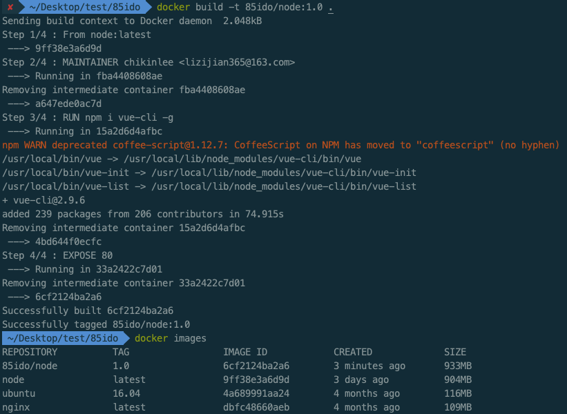

#### docker commit

使用 docker commit 来扩展一个镜像比较简单，但是不方便在一个团队中分享

- 需要在容器内操作麻烦，效率低
- 不知道这个镜像是怎么做出来的，都安装了什么,但是使用 Dockerfile 我们看到是执行了 apt-get install 命令

###上传镜像

`docker push`

例如:

在上传之前,需要先登录自己的 docker hub 账号

`docker login`

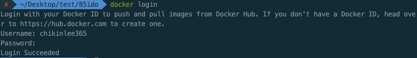

```bash
docker tag 85ido/node:1.0 chikinlee365/node:1.0
#将要发布的镜像改到自己的账户名下 我的账户名 chikinlee365
```

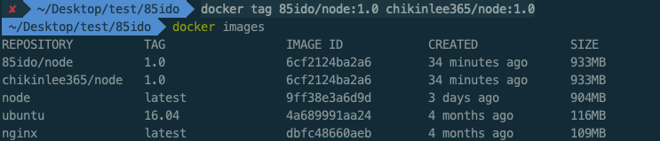

```bash
docker push chikinlee365/node:1.0
#推送到自己账户下的docker hub
```

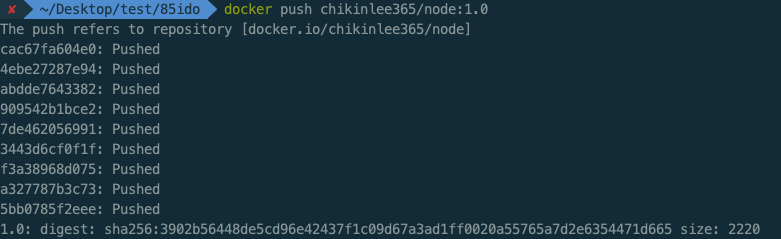

### 创建容器

#### 创建

`docker create <image-id>`

docker create 命令为指定的镜像（image）添加了一个可读写层，构成了一个新的容器。注意，这个容器并没有运行,docker create 命令提供了许多参数选项可以指定名字，硬件资源，网络配置等等。

例如:

创建一个 node 的容器,可以使用仓库+标签的名字确定 image,也可以使用 image-id 来指定,返回 image id

```bash
#仓库+标签
docker create -it --name node_container chikinlee365/node:1.0

#使用image-id
docker create -it --name node_container_by_id 6cf2124ba2a6 bash

查看目前已存在的容器列表,不加-a只显示当前运行中的容器
docker ps -a
```

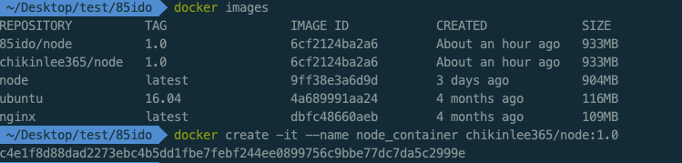

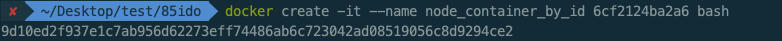

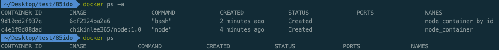

#### 将本地目录挂在到容器中

```bash
docker create -it --name node_container_golf -v ../../work/project/golfOperator node
```

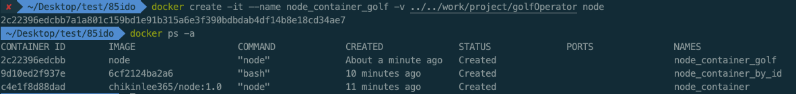

### 启动容器

·`docker start <container-id>`

Docker start 命令为容器文件系统创建了一个进程隔离空间。注意，每一个容器只能够有一个进程隔离空间。

```bash
#通过名字启动 -i为启动并进入docker容器
$ docker start -i node_container_golf

＃通过容器ID启动
$ docker start -i 2c22396edcbb
```

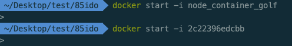

#### 进入容器

`docker exec <container-id>`

在当前容器中执行新命令，如果增加 -it 参数运行 bash 就和登录到容器效果一样的。

```bash
docker exec -it 2c22396edcbb bash
```

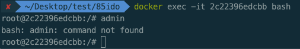

#### 停止容器

`docker stop <container-id>`

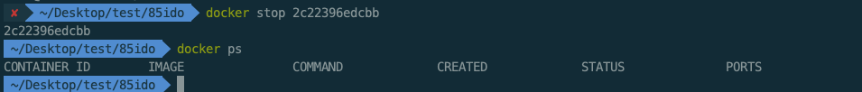

#### 删除容器

`docker rm <container-id>`


#### 删除镜像

`docker rmi <image-id>`

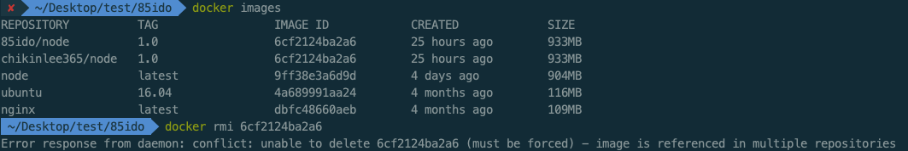

这里注意,由于同一个 image id 被两个资源所引用,所以会提示无法删除的问题

这里可以使用 `REPOSITORY:TAG`的方式删除镜像

你也可以使用-f 来强制删除只读层(镜像)

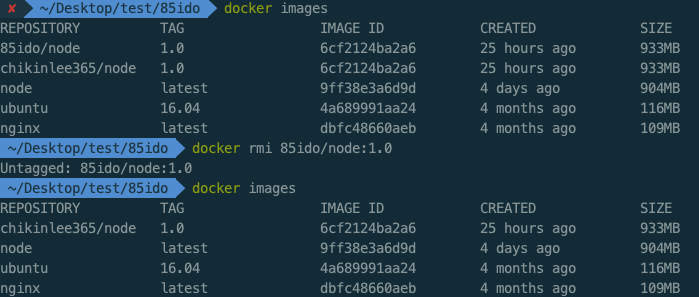

#### commit 容器

`docker commit <container-id>`

把容器(I/O)变为了一个镜像(O)

#### 镜像保存

`docker save <image-id>`

```bash
#保存镜像node(id或者REPOSITORY:TAG)到node.tar文件
docker save -o node.tar 6cf2124ba2a6
```

创建一个镜像的压缩文件，这个镜像文件可以在其他 docker 上使用（如：堡垒机）和下面的 export 不一样的是 save 可以保存每层的元数据，只对镜像有效

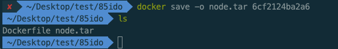

#### 容器导出

`docker export <container-id>`

创建了一个 tar 文件,并且移除掉元数据和不必要层,将多个层压缩,export 后的容器 import 到 docker 中时,不会有历史镜像,而 save 可以

#### 容器提取

`docker inspect <container-id> or <image-id>`

提取出容器或者镜像最顶层的元数据

# Dockerfile

Docker 镜像是一个特殊的文件系统，除了提供容器运行时所需的程序、库、资源、配置等文件外，还包含了一些为运行时准备的一些配置参数（如匿名卷、环境变量、用户等）。镜像不包含任何动态数据，其内容在构建之后也不会被改变。

#### Dockerfile 文件格式

```bash
#第一行必须是基础镜像信息
FROM node:latest
#维护者信息
MAINTAINER chikinlee chikinlee@163.com

#镜像操作指令
#每行的run指令，会让镜像添加新的一层并提交
RUN mkdir -p /home/www/express
#将容器内工作目录设置为/home/www/express
WORKDIR /home/www/express
#将宿主机当前目录下内容复制到镜像/home/www/express目录下
#COPY <宿主机目录> <镜像目录>
COPY . /home/www/express
RUN npm install
#对外开放容器的3000端口
EXPOSE 3000
#容器启动后执行的命令。不可被docker run提供的参数覆盖
ENTRYPOINT ["npm", "run"]
#CMD用来负责容器启动
#CMD在Dockerfile文件中仅可指定一次，指定多次时，会覆盖前的指令,可以被docker run(这里指的是docker命令，不是dockerfile中的关键字)提供的参数覆盖
CMD ["start"]
```

 上面是一个 express 镜像的 Dockerfile 的制作，上面的每一行是不是不太清楚，让我们分开来看下 dockerfile 中的各命令

#### FORM

`FORM` 指令用于指定基础镜像，比如我整个服务依靠 node 来运行，或者 centerOS 等，`FORM`指令必须是 dockerfile 的第一行，语法格式有三种

`FROM <image>`

`FROM <image>:<tag>`

`FROM <image>:<digest>`

- 通过`FROM`指定镜像，可以是任意有效的基础镜像
- 在 Dockerfile 中创建多个镜像时，`FROM`可以出现多次，但是每次有一个新的`FROM`之前，一定要提交上次的镜像 ID，特别注意的，17.05 之前的版本是不可以多个`FROM`的

- tag 或 digest 是可选的，如果不使用这两个，会默认使用 latest 版本

#### RUN

##### shell 执行

`RUN <command>`

会在 shell 执行命令，Linux 下默认使用/bin/sh -c， Windows 下使用 cmd /S /C

SHELL 会修改 RUN 下所使用的默认 shell

##### exec 执行

`RUN ["executable","param1","param2"]`

RUN 可以执行任何命令，然后在当前镜像上创建一个新层并提交，提交后的结果镜像将会用在 Dockerfile 文件的下一步

通过 RUN 执行多条命令时，可以通过 `\`换行

```bash
RUN /bin/bash -c 'source $HOME/.bashrc;\
echo $HOME'
```

也可以在同一行通过`;`分隔命令

```bash
RUN /bin/bash -c 'source $HOME/.bashrc;echo $HOME'
```

RUN 指令创建的中间镜像会被缓存，并会在下次构建中使用。如果不想使用这些缓存镜像，可以在构建时指定`--no-cache`参数，如：`docker build --no-cache`。

#### CMD

CMD 用于指定在容器启动时所要执行的命令，CMD 有三种格式

```bash
CMD ["executable","param1","param2"]
CMD ["param1", "param2"]
CMD command param1 param2
```

CMD不同于RUN，CMD用于指定容器启动时所要执行的命令，而RUN用于指定镜像创建时所要执行的命令。

CMD和docker run在功能实现上也有相似之处

```bash
docker run -t -i 85ido/85node /bin/true
```

等价于：

```bash
cmd ["/bin/true"]
```

CMD在dockerfile中只可以指定一次，多次会覆盖之前的指令

使用`docker run`运行容器时，如果没有在命令结尾指定会在容器中执行的命令，这时Docker就会执行在`Dockerfile`的`CMD`中指定的命令。

例：

```bash
CMD ["/bin/bash"]
```

执行`docker build`构建完成镜像后，名如果是` 85ido/85node`，使用这个镜像运行新容器

```bash
sudo docker run -i -t  85ido/85node
```

在`docker run`时，并没有指定命令，这时就会执行dockerfile中的CMD指令

如果想要覆盖

```bash
sudo docker run -i -t  85ido/85node /bin/ps
```

这时结尾的/bin/ps 就会覆盖CMD的/bin/bash